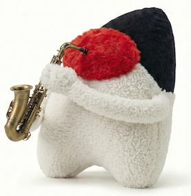

[](https://jitpack.io/#umjammer/vavi-apps-mdplayer)
[](https://github.com/umjammer/vavi-apps-mdplayer/actions/workflows/maven.yml)
[](https://github.com/umjammer/vavi-apps-mdplayer/actions/workflows/codeql.yml)


# vavi-apps-mdplayer



🎺 Video Game Music Player for Java

this is a fork of [MDPlayer](https://github.com/kuma4649/MDPlayer)

### Status

| type                            | description      |      player      | compiler | type                 | alternative                                                          | comment                                                                           |
|---------------------------------|------------------|:----------------:|:--------:|----------------------|----------------------------------------------------------------------|-----------------------------------------------------------------------------------|
| VGM/VGZ                         | video game music |       ✅️ ️       |    -     | built-in             | vavi-sound-emu                                                       |                                                                                   |
| XGM                             | mega drive       |        ✅️        |    -     | built-in             |                                                                      |                                                                                   |
| XGM2                            | mega drive       |        ✅️        |    -     | built-in             |                                                                      |                                                                                   |
| MDS                             | mega drive       |  ✅️<sup>*</sup>  |    -     | driver               | [vavi-sound-mdsdrv](https://github.com/umjammer/vavi-sound-mdsdrv)   | (*) 🐛  [pcm has problem](https://github.com/umjammer/vavi-sound-mdsdrv/issues/1) |
| MUC/MUB                         | PC88 MUCOM88     |        ✅️        |    🚧    | driver               | [vavi-sound-mucom88](https://github.com/umjammer/vavi-sound-mucom88) | 🐛 same as c# version but both wrong                                              |
| S98                             | PC98             |        ✅️        |    -     | built-in             |                                                                      |                                                                                   |
| MML/M/M2/MZ                     | PC98 PMD         |        ✅️        |    ✅️    | driver               | [vavi-sound-pmd](https://github.com/umjammer/vavi-sound-pmd)         | for commercial                                                                    |
| MPI/OPI</br>MVI/OVI</br>MZI/OZI | PC98 FMP         |        ✅️        |    ✅️    | built-in*            |                                                                      | for freeware                                                                      |
| MUS/O/OX/OY                     | PC98 muap98      |        ✅         |  ✅️ 🚧   | driver               | [vavi-sound-muap](https://github.com/umjammer/vavi-sound-muap)       | 🐛 some file output bytes is different                                            | 
| MDX                             | X68k MXDRV       |        ✅️        |    -     | built-in             |                                                                      |                                                                                   |
| MND                             | X68k MNDRV       |       ✅️ ️       |    -     | built-in             |                                                                      |                                                                                   |
| ZMD/ZMS                         | X68k ZMusic      |        ✅️        |    ✅️    | built-in*            |                                                                      |                                                                                   |
| NRD                             | X1 NRTDRV        |        ✅️        |    -     | built-in             |                                                                      |                                                                                   |
| MDL/MDR                         | MSX MoonDriver   |        ✅️        |    🚧    | ~~built-in~~, driver | [vavi-sound-moon](https://github.com/umjammer/vavi-sound-moon)       | 🐛 same as c# but both wrong                                                      |
| MGS                             | MSX MGSDRV       |        ✅️        |    -     | built-in             |                                                                      |                                                                                   |
| NDP                             | MSX NDP          |        ✅️        |    -     | built-in*            |                                                                      |                                                                                   |
| BGM/MSD                         | MSX MuSICA       |        ✅️        |    ✅️    | built-in*            |                                                                      | original also often fails                                                         |
| SID                             | commodore        | ✅️️ <sup>1</sup> |    -     | built-in, library    | [JSIDPlay2](https://github.com/umjammer/JSIDPlay2)                   |                                                                                   |
| NSF/NSFE                        | NES              |       ✅️️        |    -     | built-in             | [NsfPlayer](https://github.com/umjammer/NsfPlayer)                   | nsfe is not tested                                                                |
| AY                              | ZX               |        ✅️        |    -     | built-in             | libgme                                                               |                                                                                   |
| HES                             | PC Engine        |        ✅️        |    -     | built-in             | libgme                                                               |                                                                                   |
| GBS                             | Game Boy         |      ✅️  ️       |    -     | built-in             | [vavi-sound-emu](https://github.com/umjammer/vavi-sound-emu)         |                                                                                   |
| GYM                             | Sega Genesis     |       n/a        |    -     |                      | libgme                                                               |                                                                                   |
| KSS                             | MSX              |       ️ →        |    -     |                      | [vavi-sound-emu](https://github.com/umjammer/vavi-sound-emu)         |                                                                                   |
| SAP                             | Atari            |       n/a        |    -     |                      | libgme                                                               |                                                                                   |
| SPC                             | SNES             |        →         |    -     |                      | [vavi-sound-emu](https://github.com/umjammer/vavi-sound-emu)         |                                                                                   |
| YM                              | Atari ST         |     n/a    ️     |    -     |                      | [FastTracker_2](https://en.wikipedia.org/wiki/FastTracker_2)         |                                                                                   |
| HVL                             | Hively Tracker   |     n/a   ️      |    -     |                      | [Hively Tracker](https://github.com/pete-gordon/hivelytracker)       |                                                                                   |
| AHX                             | AHX Clone        |     n/a    ️     |    -     |                      | [AHX](http://amigascne.org/abyss/ahx/)                               |                                                                                   |
| ZGM                             | mml2vgm          |       n/a        |    -     | built-in             |                                                                      | currently support only YM2609                                                     |
| MID                             | midi             |        ️→        |    -     | built-in             | javax.sound.midi.spi                                                 |                                                                                   |
| RCP                             | recomposer       |        🚫        |    -     | built-in             |                                                                      |                                                                                   |
| RCS                             | RCP + PCM8       |        ⏳️        |    -     | built-in             |                                                                      |                                                                                   |
| WAV                             |                  |        ️→        |    -     | built-in             | javax.sound.sampled.spi                                              |                                                                                   |
| MP3                             |                  |        ️→        |    -     | built-in             | [mp3spi](https://github.com/umjammer/mp3spi)                         |                                                                                   |
| AIF                             |                  |        ️→        |    -     | built-in             | javax.sound.sampled.spi                                              |                                                                                   |

<sub>1. use JSIDPlay2 instead of built-in sid library (built-in sid library mostly works now)</sub><br/>
<sub>* at type: driver uses emulator</sub>

## Install

### Maven

 https://jitpack.io/#umjammer/vavi-apps-mdplayer

### Other Binaries

get those binaries from the internet and put those at somewhere (set system properties described below)

```
.../dirver/fmp/FMP.COM
.../dirver/fmp/FMC.EXE
.../driver/mgsdrv/MGSDRV.COM
.../driver/musica/KINROU4.COM
.../driver/musica/KINROU5.DRV
.../driver/ndp/NDP.BIN
.../driver/zms/ZMC.X
.../driver/zms/ZMSC3.X
.../driver/zms/ZMUSIC.X
.../dirver/zms/LZZ.R
```

## Usage

### via spi

```java
  AudioInputStream mdAis = AudioSystem.getAudioInputStream(new BufferedInputStream(Files.newInputStream(vgm)));
  AudioFormat inFormat = sourceAis.getFormat();
  AudioFormat outFormat = new AudioFormat(44100, 16, 2, true, false);
  AudioInputStream pcmAis = AudioSystem.getAudioInputStream(outFormat, mdAis);
  SourceDataLine line = (SourceDataLine) AudioSystem.getLine(new DataLine.Info(SourceDataLine.class, pcmAis.getFormat()));
  line.open(pcmAis.getFormat());
  line.start();
  byte[] buffer = new byte[line.getBufferSize()];
  int bytesRead;
  while ((bytesRead = pcmAis.read(buffer)) != -1) {
    line.write(buffer, 0, bytesRead);
  }
  line.drain();
```

### jvm options

```
--add-opens=java.base/java.io=ALL-UNNAMED
--add-opens=java.base/sun.nio.ch=ALL-UNNAMED
```

### System Properties

#### Important

when using this project with vgm, gbs spi, apply the settings below to avoid conflicts with each spi.

- `vavi.sound.sampled.spi.emu.vgm` ... to disable `vavi-sound-emu` vgm spi, set `false` 
- `vavi.sound.sampled.spi.emu.gbs` ... to disable `vavi-sound-emu` gbs spi, set `false`
- `vavi.sound.sampled.spi.emu.nfs` ... to disable `vavi-sound-emu` nfs spi, set `false`
- `vavi.sound.sampled.spi.mod.sid` ... to disable `vavi-sound-mod` sid spi, set `false`
- `vavi.sound.sampled.spi.ymfm` ... to disable `vavi-sound-ymfm` vgm spi, set `false`

#### pmd

- `mdplayer.pmd.pmd` ... pmd driver options
- `mdplayer.pmd.opt` ... pmd command line options

#### fmp

- `mdplayer.fmp.dir` ... location for `fmp.com`, `fmc.com` drivers
- `mdplayer.fmp.pvi` ... `.pvi` files location, nullable and multipliable by `;` separation

#### zms

- `mdplayer.zms.dir` ... location for `zm*.x` drivers
- `mdplayer.zms.zpd` ... zpd file search location, nullable and multipliable by `;` separation

#### mgs

- `mdplayer.mgs.dir` ... location for `mgsdrv.com` driver

#### ndp

- `mdplayer.ndp.dir` ... location for `ndp.bin` driver

#### musica

- `mdplayer.musica.dir` ... location for `kinrou*.*` drivers

#### muap

- `muap.dir.dta` ... `.dta` file location
- `muap.dir.pcm` ... `.pcm` file location
- `muap.dir.udp` ... `.udp` file location
- `muap.dir.sud` ... `.sud` file location

#### YM2608 drums

specify the directory for `ym2608_adpcm_rom.bin`.

`-Dmdsound.pcm.path=/Users/foo/data/roms/`

#### Chip Selection

you can select a chip implementation variant by number.

| chip    | system property          | setting                                                             |
|---------|--------------------------|---------------------------------------------------------------------|
| AY8910  | mdplayer.variant.ay8910  | 0: fmgen, 1: mame, 2: np                                            |
| SN76496 | mdplayer.variant.sn76496 | 0: sn76489, 1: sn76496                                              |
| YM2151  | mdplayer.variant.ym2151  | 0: fmgen, 1: mame, 2: 68k, 3: ymfm                                  |
| YM2203  | mdplayer.variant.ym2203  | 0: fmgen, 1: ymfm                                                   |
| YM2413  | mdplayer.variant.ym2413  | 0: mame, 1: vrc7(np), 2: emu, 3: np                                 |
| YM2608  | mdplayer.variant.ym2608  | 0: fmgen, 1: ymfm                                                   |
| YM2610  | mdplayer.variant.ym2610  | 0: fmgen, 1: ymfm                                                   |
| YM2612  | mdplayer.variant.ym2612  | 0: mame-A, 1: nuke-A, 2: mame-B, 3: nuke-B(simple), 4: nuke-A(vavi) |
| YM3812  | mdplayer.variant.ym3812  | 0: dosbox, 1: mame                                                  |
| YMF262  | mdplayer.variant.ymF262  | 0: dosbox, 1: mame, 2: nuked, 3: cozendey, 4: ymfm                  |
| Qsound  | mdplayer.variant.qsound  | 0: qsound-ctr, 1: qsound                                            |
| C140    | mdplayer.variant.c140    | 0: c140, 1: c219                                                    |
| PCM8    | mdplayer.variant.pcm8    | 0: x68sound, 1: wachoman                                            |
| MPCM    | mdplayer.variant.mpcm    | 0: x68sound, 1: wachoman                                            |

### Sample Player

[source](src/test/java/TestCase.java)

## References

* https://github.com/GhostSonic21/Java_VGMPlayer
* https://github.com/kwhat/jnativehook
* https://github.com/waynetam/JavaSSRC/tree/master (fft)
* https://github.com/kg68k/zmusic3 (zms)
* https://github.com/myon98/98fmplayer (fmp, pmd)
* https://ndp.squares.net/web/ (ndp)
* http://retropc.net/saya/x68000/ (mndrv)
* https://github.com/asma-atari-org/asma.atari.org (sap)
* https://github.com/Manicsteiner/VGMToolbox (kss, xa, xma, xsf)
* https://github.com/AnimaInCorpore/portable_mdx (mxdrv)
* s98
  * https://www.zophar.net/music/s98.html (s98)
  * https://github.com/niara3/s98txt/blob/master/src/com/niara3/s98txt/Main.java (s98)
  * http://www.vesta.dti.ne.jp/~tsato/soft_s98v3.html (s98v3)
* samples
  * https://vgmrips.net/ (vgm)
  * https://gimic.jp/index.php?%E3%83%86%E3%82%B9%E3%83%88%E3%83%87%E3%83%BC%E3%82%BF (test data)
  * https://github.com/BouKiCHi/HuSIC (hes)
  * https://www.zophar.net/music/hes.html (hes download)
  * https://github.com/vampirefrog/mdxtools (mdx)
  * https://github.com/Kermalis/VGMusicStudio (mp2k, sdat, dse (gba/nds/wii))
  * https://hoot.joshw.info/pc98/ (hoot)
  * https://github.com/uniskie/msx_music_data (musica, msx, ndp)
  * https://github.com/kg68k/zmusic3 (zms v3)
  * http://retropc.net/x68000/software/sound/zmusic/zmusic2 (zms v2)
  * https://archive.org/details/sound_canvas_midi_collection (rcp)
  * http://www.os.rim.or.jp/~terada/contents/data.htm (zms)
  * https://nfggames.com/X68000/index.php/Mirrors/Groundzero%20Organization/x68tools/music/mndrv/ (mndrv) ... google censorship
  * https://worldofspectrum.org/projectay/gdmusic.htm (ay)
* processor
  * z80 
    * https://github.com/trekawek/coffee-gb (z80)
  * x86
    * https://github.com/Tennessene/jDOSBox (i386~pentium)
    * https://github.com/bramfoo/dioscuri (x86)
    * https://github.com/ianopolous/JPC (x86)
    * https://github.com/barotto/test386.asm
  * https://github.com/tanakh/bjne-java (nes)
  * mc68000
    * https://stdkmd.net/xeij/ (mc68k)
    * https://github.com/binasc/m68000
    * https://github.com/arocketman/CPUemu
* vst
  * https://jvstwrapper.sourceforge.net/
  * https://github.com/urish/cintie/tree/master/src/main/java/org/urish/jnavst 🎯

## TODO

 * ~~spi~~
 * debug
    * ~~vgm using YM2151~~
      * ~~some timing is wrong for "Out_Run_(Arcade)/01 Magical Sound Shower.vgz"~~
        * ~~3 alter chips reproduce same glitch, so vgm driver is wrong?~~ ... yes it's unsigned short problem
    * ~~mucom: some are ok and some are not~~
    * ~~mxdrv: luck of fm channel~~
    * hes: volume related???
    * ~~ay: zxbeep~~
    * ~~fmp: fmp not resident~~
    * ~~mnd: no .mnd samples on the internet~~
    * zms: wip signed byte related ... ???
    * rcs: wip
    * rcp: wip, how to treat midi plugin as chip?
    * nsf: sp library works. `render_()` is not work, `mul` related. (replace `render_()` to vavi-sound-mdplayer:NsfTestPlayer's one, it works)
    * ~~fmp: test mochit final~~
    * mxdrv: ~~pcm8~~, when 68k opm is chosen as 1st opm, 2nd opm cannot sound pcm8. why???
    * ~~ndp: fmgen ym8910 is silence (meme's works)~~
    * ~~gbs: song no 9 -  wrong~~
 * chip class should handle one chip
 * ~~eliminate dotnet4j~~
 * ~~vgm spi selector~~
   * ~~vavi-sound-smu (wip)~~
   * ~~vavi-sound-ymfm (wip)~~
   * this spi

---

# [Original](https://github.com/kuma4649/MDPlayer)

Player such as VGM file (performance tool by emulation such as mega drive sound source chip)

## Overview  

This tool plays VGM files while displaying the keyboard.
(Supports NRD, XGM, S98, MID, RCP, NSF, HES, SID, MGS, MDR, MDX, MND, MUC, MUB, M, M2, MZ, WAV, MP3, AIFF files.)

## Note

Pay attention to the volume during playback. The noise caused by the bug may be played at a loud volume.
(If you try a file that you have never played, or if you update the program.)

If you find any problems during use, please contact the following.

 - Twitter (@kumakumakumaT_T)
 - Github Issues (https://github.com/kuma4649/MDPlayer/issues)

**!! Important !!**

For authors of VGMPlay, NRTDRV, and other great software
Please do not contact them directly about MDPlayer.
We will do our best to accommodate you, but there are many cases where we cannot meet your request. note that.

## Supported formats

 - VGM (so-called vgm file)
 - VGZ (gzipped vgm file)
 - NRD (NRTDRV X1 driver performance file that sounds 2 OPMs and AY8910)
 - XGM (File for MegaDrive)
 - S98 (mainly files for Japanese retro PC)
 - MID (Standard MIDI file. Format 0/1 compatible)
 - RCP (Recopon files CM6, GSD can be sent)
 - NSF (NES Sound Format)
 - HES (HES file)
 - SID (File for Commodore)
 - MGS (MGSDRV.COM is required to play MGSDRV files)
 - MDR (MoonDriver MSX, driver performance file that sounds MoonSound (OPL4))
 - MDX (file for MXDRV)
 - MND (Performance file of driver using MNDRV X68000 (OPM, OKIM6258) & Makyury Yunit (OPNAx2))
 - MUC (MUCOM88 file for Windows)
 - MUB (MUCOM88 file for Windows)
 - M (File for PMD)
 - M2 (file for PMD)
 - MZ (file for PMD)
 - WAV (TBD audio file)
 - MP3 (TBD audio file)
 - AIF (TBD audio file)
 - M3U (playlist)

## Functions and features

 - Currently, it is possible to play back mainly by emulating the following mega drive type sound source chips.

       AY8910, YM2612, SN76489, RF5C164, PWM, C140 (C219), OKIM6295, OKIM6258 (including PCM8, MPCM)
       , SEGAPCM, YM2151, YM2203, YM2413, YM2608, YM2610 / B, HuC6280, C352
       , K054539, NES_APU, NES_DMC, NES_FDS, MMC5, FME7, N160, VRC6
       , VRC7, MultiPCM, YMF262, YMF271, YMF278B, YMZ280B, DMG, QSound
       , S5B, GA20, X1-010, SAA1099
       , RF5C68, SID, Y8950, YM3526, YM3812, K053260, K051649 (K052539)

 - Currently, the following keyboard displays are possible.

       YM2612, SN76489, RF5C164
       , AY8910, C140 (C219), C352, SEGAPCM
       , Y8950, YM2151, YM2203, YM2413, YM2608, YM2610 / B, YM3526, YM3812
       , YMF262, YMF278B, YMZ280B, MultiPCM
       , HuC6280, MIDI
       , NES_APU & DMC, NES_FDS, MMC5, N106 (N163), VRC6, VRC7, PPZ8
  
     You can mask it by left-clicking on the channel (keyboard).
     Right-click to unmask all channels.
     (Some of them are not supported at various levels)
     Click'ch'in each keyboard display window to switch masks at once.

     You can automatically open the keyboard to be used from the information of the file to be played.
     (You can display up to two of the same keyboard, but only one MIDI keyboard will open.)

 - It is created in C#.
 - Refer to the source of VGMPlay, MAME, DOSBOX and port it.
 - Refer to the source of FMGen and port it.
 - Refer to the source of NSFPlay and port it.
 - Refer to the source of NEZ Plug ++ and port it.
 - Refer to the source of libsidplayfp and port it.
 - Refer to the source of sidplayfp and port it.
 - Refer to the source of NRTDRV and port it.
 - Refer to the source of MoonDriver and port it.
 - Refer to the MXP source and port it.
 - Refer to the source of MXDRV and port it.
 - Refer to the source of MNDRV and port it.
 - Refer to the source of X68Sound and port it.

   (Both m_puusan-san / rururutan-san version)

 - Adjusted so that the same data is output by referring to the output of CVS.EXE.
 - Playback is possible from the real YM2612, SN76489, YM2608, YM2151, YMF262 using SCCI.

   It also supports SPPCM.

 - Playback is possible from the real YM2608, YM2151, YMF262 using GIMIC (C86ctl).
 - I am using Z80dotNet.

 - The buttons are arranged in the following order.

       Set, Stop, Pause, Fade Out, Previous Song, 1/4 Speed ​​Playback, Playback, 4x Speed ​​Playback, Next Song,
       Play mode, open file, playlist,
       Information panel display, mixer panel display, panel list display, VSTeffect setting, MIDI keyboard display, display magnification change

 - Left-click the OPN, OPM, OPL tone parameter to copy the tone parameter to the clipboard as text.

   The parameter format can be changed from the option settings.

        FMP7, MDX, MUCOM88 (MUSIC LALF), NRTDRV, HuSIC, MML2VGM, .TFI, MGSC, .DMP, .OPNI

If you select .TFI / .DMP / .OPNI, it will be output to a file instead of the clipboard.

 - Although the result is a step away, it is possible to output the performance data of YM2612 and YM2151 as a MIDI file.

   If you use VOPMex, it is possible to reflect the tone color information of the FM sound source.

   (VOPMex, not VOPM.;-P)

 - PCM data can be dumped. It is output as WAV only in the case of SEGA PCM.
 - It is possible to export the performance with wav.
 - VSTi can be specified for the MIDI sound source.
 - You can play, stop, etc. from the keyboard or MIDI keyboard.
 - From the playlist, you can open the file with the same name (Text, MML, Image) with a different extension during playback.
 - A unique function has been added to the VGM / VGZ file.

   Dual performance of RF5C164

   Lyrics display

 - Enabled to operate MDPlayer using mdp.bat from the command line ♪

   The command of mdp.bat is as follows.

         PLAY [file]
         STOP
         NEXT
         PREV
         FADEOUT
         FAST
         SLOW
         PAUSE
         CLOSE
         LOOP
         MIXER
         INFO

## Operation that is a little difficult to understand

 - Double-click (toggle) the title bar of each window to always bring it to the front.
 - Added a function so that the position of the window can be initialized by starting the application while holding down the Shift key.

## Setting items that are a little difficult to understand

 - Options window> other tab> Search paths on additional file

   If you enter the path in this text box,
   When playing the song data, the file that is additionally referenced will be searched for the location.
   Multiple paths can be listed separated by;
   The files to be additionally searched for for each driver are as follows.

 - Recomposer (.RCP)

   .CM6 / .GSD

 - MoonDriver (.MDR)

   .PCM

 - MXDRV (.MDX)

   .PDX

 - MNDRV (.MND)

   .PND

In the case of PMDDotNET, the path specified by the environment variable PMD is referenced.

## G.I.M.I.C. Related Information

 - About SSG volume
   Adjust the SSG volume with the "G.OPN" and "G.OPNA" faders at the bottom right of the mixer screen.
 
   Respectively
 
       G.I.M.I.C.module set to G.OPN-> YM2203 (Pri / Sec)
       G.I.M.I.C.module set to G.OPNA-> YM2608 (Pri / Sec)
 
   The setting information is sent to.

   The settings are sent only at the start of playback.
   Therefore, even if you move the fader during a performance, the value will not be reflected immediately.
   As an initial value,
 
       .muc (mucom88)-> 63 (equivalent to PC-8801-11)
       .mub (mucom88)-> 63 (equivalent to PC-8801-11)
       .mnd (MNDRV)-> 31 (equivalent to PC-9801-86)
       .s98-> 31 (equivalent to PC-9801-86)
       .vgm-> 31 (equivalent to PC-9801-86)

   Is set.

   If necessary, adjust the balance for each driver or file,
   Save (right-click on the mixer screen to display the save menu).

   In addition, the following performance files can be set automatically by identifying the tags described in the files (TBD).

   - .S98 file

         If the word "8801" is found in the "system" tag, MDPlayer will set it to "63".
         If the word "9801" is found, MDPlayer will set it to "31".
         If both are found, "8801" is given priority.
         If not found, the value set on the mixer screen will be used.

   - .vgm file

         If the word "8801" is found in the "systemname" and "systemnamej" tags, MDPlayer will set it to "63".
         If the word "9801" is found, MDPlayer will set it to "31".
         If both are found, "8801" is given priority.
         If not found, the value set on the mixer screen will be used.

 - Frequency

Set the module frequency (chip master clock) for each file format.

The setting values are as follows.

     .vgm-> use the value set in the file
     .s98-> use the value set in the file
     .mub (mucom88)-> OPNA: 7987 200Hz
     .muc (mucom88)-> OPNA: 7987 200Hz
     .nrd (NRTDRV)-> OPM: 4000000Hz
     .mdx (MXDRV)-> OPM: 4000000Hz
     .mnd (MNDRV)-> OPM: 4000000Hz OPNA: 8000000Hz
     .mml (PMD)-> OPNA: 7987 200Hz
     .m (PMD)-> OPNA: 7987200Hz
     .m2-> OPNA: 7987 200Hz
     .mz (PMD)-> OPNA: 7987 200Hz

## Required operating environment

 - Probably Windows Vista (32bit) or later OS. I'm using Windows 10 Home (x64).

   It does not work on XP.

 - It is necessary to have .NET Framework 4 installed.

 - You need to have .NET Standard 2 installed.

 - You must have the Visual C ++ Redistributable Package for Visual Studio 2012 Update 4 installed.

 - Microsoft Visual C ++ 2015 Redistributable (x86) --14.0.23026 must be installed.

 - UNLHA32.DLL (Ver3.0 or later) must be installed to use LZH files.

 - A audio device that can play audio is required.

   You need something that has reasonable performance. UCA222, which is a bonus of UMX250, is enough. I used this.

 - If there is, SPFM Light ＋ YM2612 ＋ YM2608 ＋ YM2151 ＋ SPPCM

 - If there is, GIMIC ＋ YM2608 ＋ YM2151

 - When emulating YM2608, the following audio files are required to play the rhythm sound.

   I'm sorry for the creation method, but I'll leave it to you.

       Bass drum 2608_BD.WAV
       Hi-hat 2608_HH.WAV
       Rimshot 2608_RIM.WAV
       Snare drum 2608_SD.WAV
       Tam Tam 2608_TOM.WAV
       Top cymbal 2608_TOP.WAV

   (44.1KHz 16bit PCM monaural uncompressed Microsoft WAVE format file)

 - When emulating YMF278B, the following ROM files are required to play the MoonSound tone.

   I'm sorry for the creation method, but I'll leave it to you.

   yrw801.rom

 - The following ROM files are required for C64 emulation.

   I'm sorry for the creation method, but I'll leave it to you.

   Kernal, Basic, Character

 - A reasonably fast CPU.

   The required amount of processing varies depending on the Chip used.

   I'm using an i7-9700K 3.6GHz.

 - The following files are required to play MGSDRV files.

   (Although it is included in advance, please obtain it from the official website if necessary.) MGSDRV.COM

## Synchronization recommendation

- It is tricky to synchronize the sound by SCCI / GIMIC (C86ctl) and emulation (hereinafter abbreviated as EMU).

  I don't know what the correct answer is because it depends on the environment, but I will introduce the adjustment procedure in my environment.

1. First, select the device you want to use for audio output from the Output tab.

   The recommended pattern is to select sharing or ASIO with WasapiOut.

2. Select a delay time of 50ms or 100ms. Now press OK once to play a song that uses only EMU

   Make sure that the sound is not gritty or bubble wrap.
   (If it does not play well, set the delay time one larger.)

3. From the Sound tab, select the YM2612 SCCI and select the module you want to use.

   SCCI only

       Check "Send Wait Signal" and "Emulate PCM only" for the check boxes.
       If you check "Emulate PCM only", only PCM will be emulated.
       If you do not check it, PCM data will be sent to SCCI, but the sound quality and tempo will not be stable.
       Performing "Send Wait Signal" seems to stabilize the tempo of SCCI.
       However, if you check "Double wait", the sound quality of PCM will improve, but the tempo will tend to be disturbed.

4. For the delayed performance group, set 0ms for both SCCI / GIMIC and EMU for the time being, and check "Opportunistic mode".

   "Opportunistic mode" is, for example, when a large load is applied during a performance and the playback of SCCI / GIMIC and the playback of EMU are significantly different.

   It is a function to reduce the deviation by adjusting the playback speed of SCCI / GIMIC. However, the deviation set (intended) in the delayed performance will continue to be maintained.

5. Play a song that uses both SCCI / GIMIC and EMU, and carefully check which one sounds first.

   Increase the delayed playing time of SCCI / GIMIC and EMU, whichever is played first, and play the song to check.

   If you repeat the procedure of .5 until there is no deviation, the synchronization work is completed. enjoy!

6. About the performance gap between SCCI and GIMIC.

   If SCCI is fast, adjust the SCCI delay setting item.

   If GIMIC is fast, adjust the GIMIC delay setting item.

## MIDI keyboard recommendation

If you prepare a MIDI keyboard, you can use it to pronounce from the YM2612 (EMU).
This is a function mainly provided for MML driving support.

(Currently, there are some functions that cannot be used while they are being implemented.)

### How to use for the time being

   1. On the settings screen, select the MIDI keyboard you want to use.

   2. Send (CC: 97) while playing the YM2612 data.

      The 1Ch tone of the YM2612 is set for all channels.

   3. All you have to do is play.

### Main functions

   1. Importing tone data

      Click each OPN sound source or OPM sound source, or the tone data section of the keyboard display.

      The tone data is copied to the selected channel.

   2. Performance mode switching

      With MONO mode (playing using a single channel)

      POLY mode (playing using multiple channels (up to 6Ch))

      It is possible to switch.

          MONO mode It is assumed that a short phrase will be played when typing and output as MML.
          POLY mode Assumed to be used to check chords when typing.

   3. Channel note log

      You can record up to 100 pronunciations for each channel.

   4. Channel note log MML conversion function

      Click the log field to copy the pronunciation record as MML to the clipboard.

      The note length is not output. The corresponding command is c d e f g a b o <>.

      Octave information is absolutely specified by the o command only for the first note,

      After that, it is expanded by relative specification by <command> command.

   5. Save and load tones

      It is possible to save or load 256 types of tones in the memory.

      The data can be output or read to a file in the specified format.

      It can be saved and loaded in the following software formats.

          FMP7
          MUCOM88 (MUSIC LALF / mucomMD2vgm)
          NRTDRV
          MXDRV
          mml2vgm

   7. Simple tone editing (TBD)

      After selecting the parameter you want to enter, you can edit it by entering a numerical value.

### screen

   1. Keyboard (TBD)

      The note being played is displayed.

   2. MONO

       Click to switch to MONO mode. When it switches, it becomes a ♪ icon.

   3. POLY

       Click to switch to POLY mode. When it switches, it becomes a ♪ icon.

   4. PANIC

       Sends keyoff to all channels. (Used when the sound keeps ringing.)

   5. L.CLS

      Clear the note log for all channels.

   6. TP.PUT

      Saves the tone of the selected channel to the TonePallet (tone storage area in memory).

   7. TP.GET

      Loads the tone from the TonePallet into the selected channel.

   8. T.SAVE

       Save the TonePallet to a file.

   9. T.LOAD

      Load the TonePallet from the file.

   10. Tone data

   11. Tone data (6Ch minutes)
       - You can select or deselect a channel by clicking "-" or "♪".
       - You can change a parameter by right-clicking it. (TBD)
       - Left-click the parameter to display the context menu.
         - Copy: Copies the clicked tone to the clipboard.
         - Paste: Pastes the clipboard tone to the clicked tone.
       
         You can change the text format used by the above functions by clicking the software name in the FORMAT column.
         You can also copy and paste by key operation. In this case, the selected channel will be the target.
         The format is not automatically determined when pasting.
       - Click "♪" next to "LOG" to clear the note log of that channel.
       - Click LOG to set MML data to the clipboard.

### Operation from the MIDI keyboard

The following is the case of the default setting. (Customizable in the settings. It is also possible not to use it by leaving the setting value blank.)

 - CC: 97 (DATA DEC)

Copy the 1Ch tone of the YM2612 to all channels. (Ignore selection status)

 - CC: 96 (DATA INC)

Delete only one of the latest logs. (Function to cancel playing mistakes, etc.)

 - CC: 66 (SOSTENUTO)

Only in MONO mode, set the log of the selected line to MML and set it to the clipboard.
Difference from the process when clicking the screen

    Send Ctrl + V (paste) keystrokes.
    Clears the note log for the selected channel.
    The first octave command is not output.

## Special Thanks

This tool is indebted to the following people. We also refer to and use the following software and web pages.

thank you very much.

 - Rael-san
 - Tobokegao-san
 - HI-RO-san
 - Gashi3-san
 - Oyajipipi-san
 - Osoumen-san
 - Naruto-san
 - hHex125-san
 - Kitao Nakamura-san
 - Kuroma-san
 - Kakiuchi-san
 - Bo☆Kichi-san
 - DJ.tuBIG/MaliceX-san
 - Jigofurin-san
 - WING-san
 - Sonson-san
 - OobaGo-san
 - sgq1205-san
 - Chigiri@ButchigiriP(but80)-san
 - Hippopo-san
 - Ichiro Ota-san

 - Visual Studio Community 2015/2017
 - MinGW/msys
 - gcc
 - SGDK
 - VGM Player
 - Git
 - SourceTree
 - Sakura Editor
 - VOP Mex
 - NRTDRV
 - MoonDriver
 - MXP
 - MXDRV
 - MNDRV
 - MPCM
 - X68 Sound
 - Hoot
 - XM6 TypeG
 - ASLPLAY
 - NAUDIO
 - VST.NET
 - NSFPlay
 - CVS.EXE
 - KeyboardHook3.cs
 - MUCOM88
 - MUCOM88windows
 - C86ctl source
 - MGSDRV
 - Z80dotNET
 - BlueMSX

 - SMS Power!
 - DOBON.NET
 - Wikipedia
 - GitHub
 - Nururi.
 - Gigamix Online
 - MSX Datapack wiki conversion plan
 - MSX Resource Center
 - Msxnet
 - Link destination of Xyz's tweet (https://twitter.com/XyzGonGivItToYa/status/1216942514902634496?s=20)
 - Ganzu Work's Diary

## FAQ

### It does not start

  - Case1

This is because the zone identifier has been added to the file and an error will occur during startup.
The zone identifier is one of the protection functions of the OS and is automatically added to the file downloaded from the net to prevent the execution of unintended files.
However, it will interfere with what you intentionally downloaded like this time.

→ Double-click removeZoneIdent.bat that can be created by unzipping it to execute it.
This batch file deletes zone identifiers in bulk.
By the way, the following message is displayed.

    An unknown error has occurred.
    Exception Message:
    Could not load file or assembly
    'file: //.....dll' or one of its dependencies, Operation is not supported.
    (Exception from HRESULT: xxxx)

  - Case2

It mainly occurs when using a real chip. This is because SCCI is ready to use c86ctl.
Since MDPlayer also uses c86ctl, it will be in conflict and will fail to start.

→ Use scciconfig.exe to uncheck "enable" which is a setting item of c86ctl.

  - Case3

This is because the version of .NET framework is different.

→ It may be improved by installing the latest .NET framework.
By the way, the following message is displayed.

    An unknown error has occurred.
    Exception Message:
    Could not load file or assembly
    'netstandard, Version = ..., Culture = ..., PublicKeyToken = ...' or one of its dependencies. The specified file cannot be found.

  - CaseX

TBD

### The tempo is not stable, the beginning of the song is not played at the start of the performance, and the song is fast forwarded.

   - Case1

It mainly occurs when using a real chip. The actual chip takes a little time to process at the start of playing.
On the other hand, the process at the start of playing the emulation is completed immediately.
This is because the actual chip tries to catch up with the emulation in order to close the time difference.

→ "Option" screen: "Sound" tab: Uncheck the "Opportunism" check box at the bottom left.

   - CaseX

TBD

### The sound is interrupted. The display is very heavy

 - Case1

It occurs when all the necessary processing is not done within the limited time.
Open the "Output" tab from the "Options" screen and switch devices.
Which device is better depends on the environment, so we recommend that you try various things.
Wasapi and ASIO often get good response.
Depending on the device, adjusting the "delay time (rendering buffer)" value may improve the situation.

 - CaseX

TBD

## Copyright / Disclaimer

MDPlayer is subject to the MIT license. See LICENSE.txt.
The copyright is owned by the author.
This software is not guaranteed and is due to the use of this software
The author does not take any responsibility for any damage.
In addition, the MIT license requires a copyright notice and this license notice, but this software does not require it.
And the source code of the following software is ported and modified for C #, or used as it is.
The copyright of these sources and software is owned by each author. Please refer to each document for the license.

 - VGMPlay
 - MAME
 - DOSBOX
 - FMGen
 - NSFPlay
 - NEZ Plug++
 - Libsidplayfp
 - Sidplayfp
 - NRTDRV
 - MoonDriver
 - MXP
 - MXDRV
 - MNDRV
 - X68 Sound
(Both m_puusan / rururutan version)
 - MUCOM88
 - MUCOM88windows (mucomDotNET)
 - M86 (M86DotNET)
 - VST.NET
 - NAudio
 - SCCI
 - C86ctl
 - PMD (PMDDotNET)
 - MGSDRV
 - Z80dotNet
 - Mucom88torym2612

---

<sub>image designed by @umjammer, drawn by nano banana</sub>
